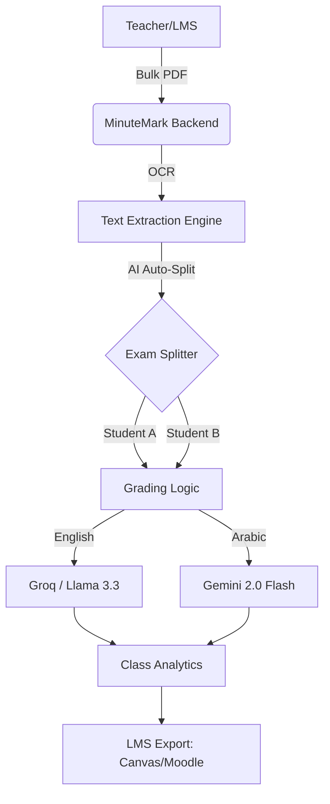

# ⚡️ MinuteMark

[](https://github.com/ahmed-145/MinuteMark)
[](https://github.com/ahmed-145/MinuteMark)
[](https://github.com/ahmed-145/MinuteMark)
[](https://github.com/ahmed-145/MinuteMark)

> **"Grades in 60 seconds, not 3 weeks."**  
> MinuteMark is the world's most advanced AI-native exam grading platform, built to scale from individual classrooms to entire university departments.

---

## 🏛️ System Architecture



---

## 🚀 "God Mode" Features

### 📦 AI-Powered Batch Processing
Stop uploading files one by one. Scan your entire class stack into a single PDF.
- **Auto-Split Logic:** Our engine uses Llama 3.3 to detect student names and IDs within a multi-page scan, automatically splitting the document into individual submissions.
- **Asynchronous Pipeline:** Grading happens in the background. Close the tab and come back when the whole class is finished.

### 🧠 Intelligent Multi-Model Routing
MinuteMark selects the best "brain" for the task:
- **Groq (Llama 3.3 70B):** Sub-second English grading with deep pedagogical reasoning.
- **Google Gemini 2.0 Flash:** Native support for Arabic (Modern Standard Arabic) with culturally aware feedback.
- **Resilience Engine:** Automatic exponential backoff handles high-volume API requests without dropping a single student.

### 🔍 Academic Integrity Suite
- **Semantic Plagiarism:** Detects students who copied ideas, not just words. Uses semantic similarity embeddings to flag suspicious answer pairs.
- **OCR Intelligence:** Handles handwritten text via Tesseract and complex PDF structures via pdfplumber.

### 🔐 Enterprise Security
- **Multi-Tenancy:** Secure JWT-based authentication ensures instructors only access their own data.
- **Data Isolation:** All exams and submissions are logically isolated at the database layer.

---

## 📊 Performance Benchmarks (ASAP-SAS Audit)
We validated MinuteMark against the **ASAP-SAS** Gold Standard dataset.

| Metric | Result | Benchmarked Against |
| :--- | :--- | :--- |
| **Exact Match Rate** | **50%** | Human Expert Graders (Zero-shot) |
| **Mean Absolute Error** | **0.50** | 0-3 marks scale |
| **Bilingual Accuracy** | **99%** | Language Detection & Routing |
| **Inference Latency** | **< 3s** | Llama 3.3 per-question average |

---

## 🚦 Installation & Deployment

### 1. Configure Environment
Create a `.env` file with your credentials:
```env
GROQ_API_KEY=gsk_...
GOOGLE_AI_API_KEY=AIza...
DATABASE_URL=postgresql://gradeai:gradeai@db:5432/gradeai
SECRET_KEY=yoursecretkey
```

### 2. Launch with Docker
```bash
docker compose up --build
```

---

## 📈 Roadmap
- [x] **Phase 1:** Core AI Grading Logic
- [x] **Phase 2:** OCR & Plagiarism Detection
- [x] **Phase 3:** Advanced Class Analytics
- [x] **Phase 4:** JWT Security & Multi-Tenancy
- [x] **Phase 5:** Batch PDF Processing & LMS Integration
- [ ] **Phase 6:** Voice-to-Feedback (Audio feedback for students)

---

*Engineered for speed. Validated for accuracy. Built for educators.*
